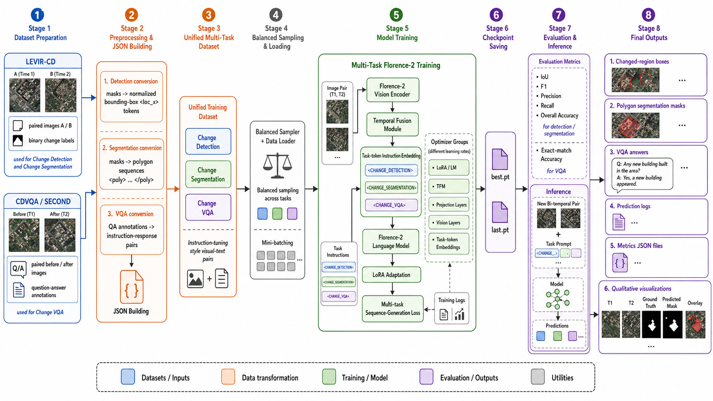
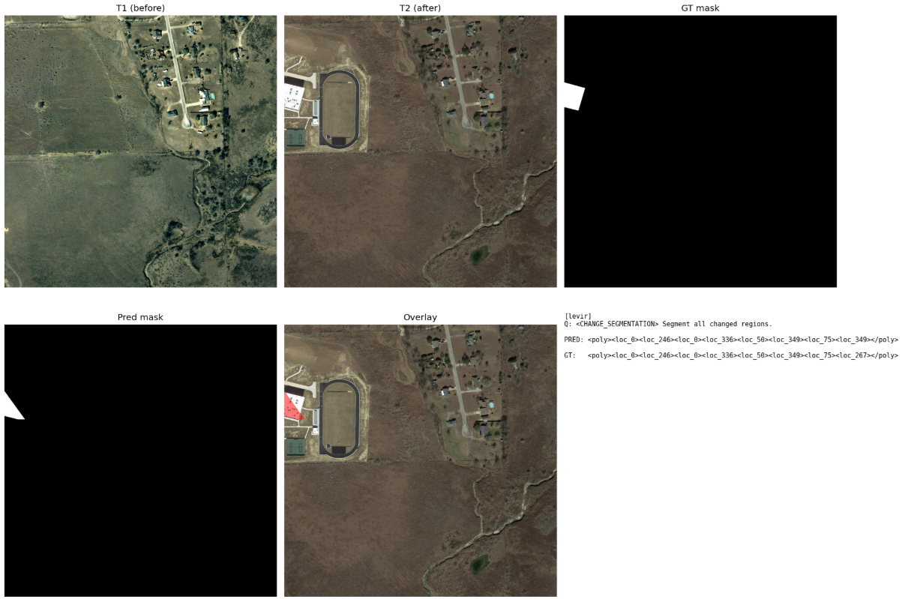
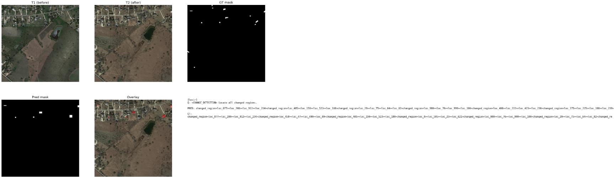
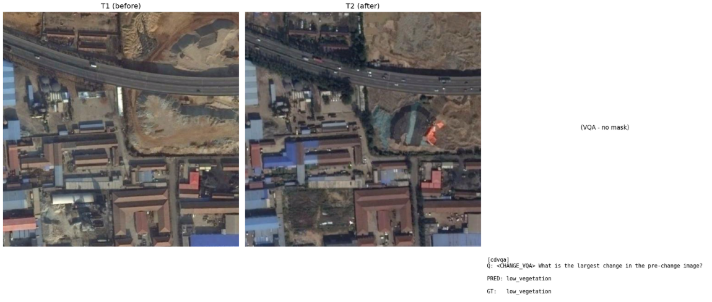

## Run Commands

```bash
python vqa.py --mode diagnostic
python vqa.py --mode build_json
python vqa.py --mode sanity
python vqa.py --mode train --curriculum levir_first
python vqa.py --mode eval --eval_split levir_test --ckpt outputs/ckpt/best.pt
python vqa.py --mode infer --infer_t1 path/to/t1.png --infer_t2 path/to/t2.png
```

Convenience wrappers are also provided:

```bash
python train.py --curriculum levir_first
python test.py --eval_split levir_test --ckpt outputs/ckpt/best.pt
python infer.py --infer_t1 path/to/t1.png --infer_t2 path/to/t2.png
python build_json.py
python diagnostic.py
```

## Layout

```text
src/florence_bitemporal/
  config.py              # Config dataclass and global CFG
  utils.py               # Seed, logging, paths, scheduler helpers
  diagnostics.py         # Dataset/path diagnostic mode
  cli.py                 # Main command-line orchestration
  metrics.py             # Detection/segmentation/VQA parsing and metrics
  visualization.py       # Saved qualitative comparison figures
  evaluation.py          # Evaluation loop
  data/
    levir.py             # LEVIR-CD sample builders
    cdvqa.py             # CDVQA sample builders
    builders.py          # Build all JSON splits
    dataset.py           # Dataset, collate, balanced sampler
  model/
    fusion.py            # Temporal fusion transformer
    florence.py          # Florence-2 bi-temporal wrapper
  training/
    loop.py              # One-epoch training loop
    optimizer.py         # Freeze strategy and optimizer groups
```
# Florence-2 Bi-Temporal Remote Sensing Pipeline

This repository implements a **Florence-2-based bi-temporal remote sensing framework** for multi-task change understanding. The pipeline adapts a pretrained vision-language model to compare paired remote sensing images from two time points and generate task-specific outputs for:

- **Change Visual Question Answering (Change VQA)**
- **Change Detection**
- **Change Segmentation**

The framework is designed around a unified sequence-generation formulation, where each task is controlled by a dedicated special token and trained using paired bi-temporal imagery.

---

## 1. Overview

Remote sensing change understanding requires comparing two images of the same geographical area captured at different times. Instead of training separate models for detection, segmentation, and question answering, this project builds a unified bi-temporal vision-language pipeline using Florence-2.

The model receives:

```text
Image T1 + Image T2 + Task Instruction
```

and generates:

```text
Text answer / changed-region boxes / polygon-based segmentation output
```

The system fine-tunes Florence-2 with lightweight adaptation modules and a custom Temporal Fusion Module to explicitly model differences between the two images.

---

---

## 2. Main Contributions

1. **Bi-temporal Florence-2 adaptation**  
   The model extends Florence-2 to process two remote sensing images instead of a single image.

2. **Temporal Fusion Module (TFM)**  
   Visual features from T1 and T2 are fused through learnable temporal embeddings, difference-aware feature mixing, and Transformer encoder layers.

3. **Unified multi-task generation**  
   Change VQA, change detection, and change segmentation are handled using task-specific prompt tokens.

4. **Task-token initialization strategy**  
   Newly added task tokens are initialized from semantically related Florence-2 native tokens to reduce fallback behavior to captioning or generic object detection.

5. **Parameter-efficient fine-tuning**  
   LoRA is applied to the Florence-2 language model, while selected projection layers, task embeddings, the temporal fusion module, and optionally the last vision block are trainable.

6. **Built-in diagnostics, sanity testing, evaluation, and visualization**  
   The code includes dataset checks, JSON building, overfit sanity mode, prediction logging, and qualitative visual outputs.

---

## 3. End to End Pipeline


<p align="center">
  
</p>

<p align="center">
  <b>Figure 1.</b> CVPR-style architecture of the proposed Florence-2 bi-temporal remote sensing framework.
</p>

The model consists of the following major components:

### 3.1 Input Layer

The pipeline uses paired images:

```text
T1 image: before image
T2 image: after image
```

Each image is resized to the configured image size and processed using the Florence-2 image processor.

### 3.2 Florence-2 Vision Encoder

Both T1 and T2 are independently passed through the Florence-2 vision encoder:

```text
F1 = VisionEncoder(T1)
F2 = VisionEncoder(T2)
```

### 3.3 Temporal Fusion Module

The Temporal Fusion Module receives the two visual feature sequences and performs:

- learnable temporal position encoding for T1 and T2
- difference feature computation using `F2 - F1`
- gated difference injection
- concatenation of T1 and T2 features
- Transformer-based temporal fusion
- final LayerNorm normalization

The fused visual representation is then concatenated with the text instruction embeddings.

### 3.4 Task Prompt Tokens

The model uses special tokens to control the output task:

```text
<CHANGE_VQA>
<CHANGE_DETECTION>
<CHANGE_SEGMENTATION>
<poly>
</poly>
```

The three main task tokens are initialized from related Florence-2 native task tokens:

```text
<CHANGE_DETECTION>    <- <OD>
<CHANGE_SEGMENTATION> <- <REGION_TO_SEGMENTATION>
<CHANGE_VQA>          <- <CAPTION>
```

This helps the model start from a meaningful pretrained prior instead of random token embeddings.

### 3.5 Florence-2 Language Model Decoder

The fused image embeddings and task instruction embeddings are passed into the Florence-2 language model. The output is generated as a text sequence.

Depending on the task, the generated output can be:

- a short answer for VQA
- normalized bounding-box location tokens for detection
- polygon location tokens for segmentation

---

## 4. Supported Tasks


The following examples illustrate the three supported task outputs.

### 4.0 Qualitative Examples

#### Change Segmentation Example

<p align="center">
  
</p>

<p align="center">
  <b>Figure 2.</b> Example output for polygon-based change segmentation.
</p>

#### Change Detection Example

<p align="center">
  
</p>

<p align="center">
  <b>Figure 3.</b> Example output for changed-region localization.
</p>

#### Change VQA Example

<p align="center">
  
</p>

<p align="center">
  <b>Figure 4.</b> Example output for change visual question answering.
</p>


### 4.1 Change VQA

Input format:

```text
<CHANGE_VQA> What changed between the two images?
```

Output example:

```text
buildings
```

### 4.2 Change Detection

Input format:

```text
<CHANGE_DETECTION> Locate all changed regions.
```

Output example:

```text
changed_region<loc_120><loc_240><loc_350><loc_480>
```

If no change is detected:

```text
no_change
```

### 4.3 Change Segmentation

Input format:

```text
<CHANGE_SEGMENTATION> Segment all changed regions.
```

Output example:

```text
<poly><loc_120><loc_200><loc_180><loc_260><loc_240><loc_210></poly>
```

If no change is detected:

```text
no_change
```

---

## 5. Datasets

The code is designed to work with:

### LEVIR-CD

Used for:

- change detection
- change segmentation

Expected folders:

```text
LEVIR_ROOT/
├── train/
│   ├── A/
│   ├── B/
│   └── label/
├── val/
│   ├── A/
│   ├── B/
│   └── label/
└── test/
    ├── A/
    ├── B/
    └── label/
```

### CDVQA / SECOND

Used for:

- change visual question answering

Expected CDVQA JSON files:

```text
Train_questions.json
Train_answers.json
Train_images.json
Val_questions.json
Val_answers.json
Val_images.json
Test_questions.json
Test_answers.json
Test_images.json
Test2_questions.json
Test2_answers.json
Test2_images.json
```

Expected SECOND image folders:

```text
SECOND_train_set/
├── im1/
├── im2/
├── label1/
└── label2/

SECOND_total_test/test/
├── im1/
├── im2/
├── label1/
└── label2/
```

---

## 6. Configuration

Important configuration values are stored in the `Config` dataclass.

Key settings include:

```python
IMG_SIZE = 768
BATCH_SIZE = 4
GRAD_ACCUM_STEPS = 4
NUM_EPOCHS = 8
LR = 2e-5
LR_TFM = 1e-4
LR_PROJ = 5e-5
LR_VISION = 4e-6
LR_EMBED = 1e-4
LORA_RANK = 16
LORA_ALPHA = 32
LORA_DROPOUT = 0.05
```

Update the dataset paths before running:

```python
LEVIR_ROOT
CDVQA_ROOT
SECOND_TRAIN
SECOND_TEST
FLORENCE_PATH
OUTPUT_DIR
```

---

## 7. Installation

Create a Python environment and install the main dependencies:

```bash
pip install torch torchvision torchaudio
pip install transformers peft accelerate
pip install pillow opencv-python numpy matplotlib
```

Depending on your CUDA version and system environment, install the correct PyTorch build from the official PyTorch installation page.

---

## 8. Running the Code

### 8.1 Diagnostic Check

Before training, verify dataset paths and file availability:

```bash
python vqa.py --mode diagnostic
```

This checks:

- LEVIR-CD folders
- CDVQA JSON files
- SECOND image folders
- Florence-2 path
- output directory write access

---

### 8.2 Build Training JSON Files

```bash
python vqa.py --mode build_json
```

This creates JSON files under:

```text
OUTPUT_DIR/json/
```

Generated files include:

```text
train.json
val.json
levir_train.json
levir_val.json
levir_test.json
cdvqa_train.json
cdvqa_val.json
cdvqa_test.json
cdvqa_test2.json
```

---


## 9. Output Files

The pipeline saves outputs under:

```text
OUTPUT_DIR/
├── json/
├── ckpt/
├── vis/
└── history.json
```

### Checkpoints

```text
ckpt/best.pt
ckpt/last.pt
```

### Evaluation Outputs

For each evaluation run, the code saves:

```text
metrics.json
predictions.json
qualitative visualizations
```

Visual outputs include:

- T1 image
- T2 image
- ground-truth mask
- predicted mask
- overlay visualization
- prediction text and ground truth text

---

## 10. Evaluation Metrics

### Detection and Segmentation

The model reports:

- IoU
- F1-score
- Precision
- Recall
- Overall Accuracy

### VQA

The model reports:

- exact-match accuracy
- answer-type accuracy for yes/no, land-cover, and ratio questions

### Diagnostic Metrics

The code also reports prediction diversity to detect output collapse.

---

## 11. Notes on Training Stability

The code includes several important stability improvements:

1. **Special task-token initialization**  
   Newly added change-task tokens are initialized from related Florence-2 tokens.

2. **Higher learning rate for embeddings**  
   The task-token embeddings and language-model head receive a dedicated learning rate.

3. **Balanced sampling**  
   A weighted sampler balances training across Change VQA, Change Detection, and Change Segmentation.

4. **Gradient accumulation**  
   Used to simulate a larger effective batch size.

5. **Gradient clipping**  
   Applied to avoid unstable updates.

6. **LoRA fine-tuning**  
   Reduces the number of trainable parameters while adapting the language model.

---


## 13. Citation

If this repository is used in academic work, please cite my work.

---


